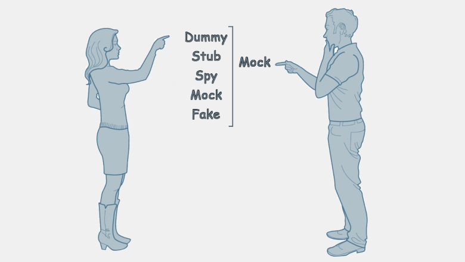

# RSpec Cheatsheet

## [Official documentation](https://rspec.info/documentation/)

## [Style Guide](https://rspec.rubystyle.guide/)

## Table of Contents

1. [Declaring tests and grouping examples](#declaring-tests-and-grouping-examples)
2. [Expectation / Matcher Methods](#expectation--matcher-methods)
3. [Declaring test objects (`let`)](#declaring-test-objects-let)
4. [Using `described_class`](#using-described_class)
5. [Test doubles and isolation](#test-doubles-and-isolation)
6. [Hooks: `before`, `after`, `around`](#hooks-before-after-around)
7. [Tags and metadata](#tags-and-metadata)
8. [Running RSpec from command line](#running-rspec-from-command-line)

## Declaring tests and grouping examples

```ruby
RSpec.describe 'Array' do
  # it: most common way to define an example
  it 'has size 0 when newly created' do
    expect(Array.new.size).to eq(0)
  end

  # specify: alias for it
  specify 'new array is empty' do
    expect(Array.new).to be_empty
  end

  # example: alias for it
  example 'new array has length 0' do
    expect(Array.new.length).to eq(0)
  end

  # describe: group related examples
  # describe — WHAT is being tested (class, method)
  describe '#push' do
    it 'adds an element to the array' do
      arr = []
      arr.push(1)
      expect(arr).to eq([1])
    end
  end

  # context: alias for describe for readability
  # context  — WHEN / under which conditions
  context 'when the array is empty' do
    it 'has size zero' do
      expect(Array.new.size).to eq(0)
    end
  end
end
```
## Expectation / Matcher Methods
```ruby
RSpec.describe 'Matchers' do
  it 'supports basic matchers' do
    expect(5).to eq(5)                 # equality
    expect(nil).to be_nil              # nil check
    expect([1,2,3]).to include(2)      # inclusion
    expect(10).not_to eq(5)            # negative match
    # stricter than be_a / be_an / be_kind_of (does not allow subclasses)
    expect("Hello").to be_an_instance_of(String) # type check
  end
end
```
## Declaring test objects (`let`)
* `let` is lazy (evaluated on first call)
* `let!` is eager (evaluated before each example)
```ruby
RSpec.describe 'Using let' do
  let(:user) { { name: 'Alice', age: 30 } }  # memoized helper

  it 'can access the memoized user' do
    expect(user[:name]).to eq('Alice')
  end
end
```
* `let` is memoized per-example, not shared between examples
## Using `described_class`
```ruby
RSpec.describe ExchangeIt::Account do
  let(:user_class) { Struct.new(:name, :surname) }
  let(:john) { described_class.new(user_class.new('John', 'Doe')) }

  it 'initializes with user' do
    expect(john).to be_a(described_class)
  end
end
```
## Test doubles and isolation
### Dummy class for testing modules (not an RSpec double)
Modules cannot be instantiated directly. Use a dummy class to test module behavior. This pattern is useful when testing modules with behavior but no state.
```ruby
module ExchangeIt
  module Utils
    module Uid
      def generate; 'uid' end
    end
  end
end

RSpec.describe ExchangeIt::Utils::Uid do
  let(:dummy) { Class.new { include ExchangeIt::Utils::Uid }.new }

  it 'can call methods from the included module' do
    expect(dummy.generate).to eq('uid')
  end
end
```
### Stub vs Mock vs Spy vs Null Object


RSpec provides several types of test doubles with different purposes.

#### Stub
A stub defines a predefined response but does not set expectations by itself.
```ruby
converter = double(:converter, convert: 100)
converter.convert # => 100
```
#### Mock
A mock sets expectations before execution and fails if they are not met.
```ruby
converter = double(:converter)
expect(converter).to receive(:convert)
converter.convert
```
#### Spy
A spy records messages and allows expectations after execution.
```ruby
converter = spy(:converter)
converter.convert
expect(converter).to have_received(:convert)
```
In modern RSpec usage, spies are generally preferred over classic mocks.
#### Null Object
A null object responds to any message without raising errors.
```ruby
converter = double(:converter).as_null_object
converter.anything
```
#### Verifying doubles
Verifying doubles ensure that stubbed or expected methods exist on the real object. They provide stronger guarantees by:
* checking method existence
* checking method visibility
* failing when the real interface changes
```ruby
converter = instance_double(Converter)
```
Compared to a regular double, verifying doubles help keep tests aligned with real code.
```ruby
double(:converter)          # no interface verification
instance_double(Converter)  # verifies instance methods
class_double(Converter)     # verifies class methods
```
#### Shorthand stub syntax equivalence
The following two forms are equivalent.
```ruby
converter = instance_double(described_class, convert: 100)
```
Is equivalent to:
```ruby
converter = instance_double(described_class)
allow(converter).to receive(:convert).and_return(100)
```
The shorthand form is syntactic sugar and is useful for simple cases. Use explicit `allow` when more configuration is needed.
#### Argument constraints with `with`
You can restrict stubs or expectations to respond only to specific arguments.
```ruby
allow(converter).to receive(:convert)
  .with(sum: 80)
  .and_return(100)
```
If the method is called with different arguments, the test will fail. This helps make expectations more precise.
#### Partial doubles (partial stubs)
A partial double is a real object with some methods stubbed. Use partial doubles with care, as they couple tests to implementation details.
```ruby
specify '#transfer_with_conversion' do
  allow(john).to receive(:convert)
    .with(sum: 50, from: :usd, to: :eur)
    .and_return(40)

  john.transfer_with_conversion(ann, 50, :usd, :eur)

  expect(john.balance).to eq(50)
  expect(ann.balance).to eq(40)
  expect(john).to have_received(:convert).once
end
```
Partial doubles are useful when you want to test real behavior while isolating specific dependencies.
### Matchers for spies
Spies allow verifying received messages after execution.
```ruby
user = spy(:user)
user.login
user.logout
expect(user).to have_received(:login)
expect(user).to have_received(:logout).once
expect(user).to have_received(:login).with(no_args)
```
Common spy-related matchers:
* `have_received`
* `once`, `twice`
* `exactly(n).times`
* `with(...)`
* `ordered`
#### Configuring responses (RSpec Mocks)
When allowing or expecting messages, the default response is `nil`. RSpec provides several methods to configure responses.
##### `and_return` Returns a specific value.
```ruby
allow(converter).to receive(:convert).and_return(100)
```
##### `and_raise` Raises an exception.
```ruby
allow(converter).to receive(:convert).and_raise(StandardError)
```
##### `and_throw` Throws a symbol.
```ruby
allow(converter).to receive(:convert).and_throw(:error)
```
##### `and_yield` Yields control to a block.
```ruby
allow(converter).to receive(:convert).and_yield(100)
```
##### `and_call_original` Calls the original implementation.
```ruby
allow(converter).to receive(:convert).and_call_original
```
##### `and_wrap_original` Wraps the original method.
```ruby
allow(converter).to receive(:convert).and_wrap_original do |original, *args|
  original.call(*args) * 2
end
```
##### `and_invoke` Invokes a callable object.
```ruby
allow(converter).to receive(:convert).and_invoke(-> { 100 })
```
## Hooks: `before`, `after`, `around`
Prefer `let` over instance variables `@var` for clarity and isolation. But instance variables are still supported
```ruby
RSpec.describe 'Hooks' do
  before(:each) do
    @arr = []
  end

  after(:each) do
    @arr.clear
  end

  around(:each) do |example|
    puts "Before example"
    example.run
    puts "After example"
  end

  it 'uses before hook' do
    @arr.push(1)
    expect(@arr).to eq([1])
  end
end
```
## Tags and metadata
Tags are commonly used to:
* run slow/fast specs
* separate integration tests
* enable platform-specific behavior
### Tags on examples
```ruby
RSpec.describe 'Tags' do
  # These two forms are equivalent:
  # it 'has zero balance', fast: true do
  # it 'has zero balance', :fast do
  #
  # Symbol-style (:fast) is preferred.

  it 'has zero balance', :fast do
    expect(0).to eq(0)
  end
end
```
### Tags on `describe` / `context` blocks
```ruby
RSpec.describe 'Utils', :utils do
  it 'inherits metadata from describe' do
    expect(true).to eq(true)
  end
end
```
### Directory-based metadata (`spec_helper.rb`)
Assign metadata to all specs in a directory:
```ruby
RSpec.configure do |config|
  config.define_derived_metadata(file_path: %r{exchange_it/utils}) do |meta|
    meta[:utils] = true
  end
end
```
### Platform-specific tests (`spec_helper.rb`)
Example: exclude specs unless running on Linux
```ruby
RSpec.configure do |config|
  config.filter_run_excluding :linux_only unless RUBY_PLATFORM.include?('x86_64-linux')
end
```
## Running RSpec from command line
### Run only specs with a specific tag
```bash
rspec --tag fast
```
### Exclude specs with a specific tag
```bash
rspec --tag ~fast
```
### Run specs by description (search by name)
```bash
rspec -e name
```
### Run only failed specs from previous run
In `spec_helper.rb`:
```ruby
RSpec.configure do |config|
  config.example_status_persistence_file_path = 'spec/specs.txt'
end
```
Then run:
```bash
rspec . --only-failures
```
### Find slowest specs
```bash
rspec . --profile 3
```
(3 can be replaced with any number)
### Focused specs
RSpec provides focused versions of examples and groups:
* `fit` → same as `it ..., :focus`
* `fspecify` → same as `specify ..., :focus`
* `fdescribe` → same as `describe ..., :focus`

Run focused specs:
```bash
rspec --tag focus .
```
### Documentation format
```bash
rspec --format documentation
```
### Reproduce random order failures
```bash
rspec --seed 12345
```
or
```bash
rspec --order rand
```
### Colorize output
```bash
rspec --color
```
